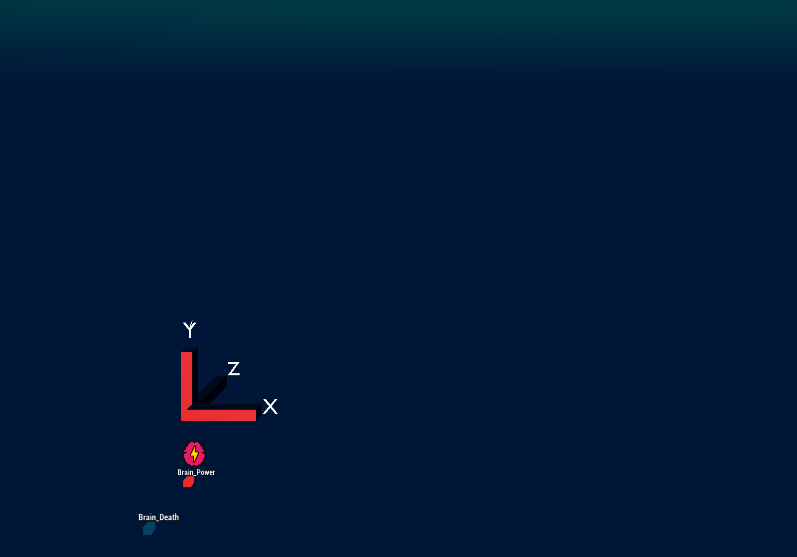

# Brain Visualizer
Brain Visualizer is FEAGI's interactive interface for building and connecting brain structures. It offers real-time 3D visualization of neuronal activity, allowing users to manually stimulate neurons and explore neuronal circuits in detail.

# Deployment Options
## Deploy as a Docker container
Please see here: https://github.com/feagi/feagi/wiki/Deployment/_edit#dependencies

## Deploy as a cloud instance
Please see here: https://github.com/feagi/feagi/wiki/Deployment/_edit#dependencies-2

## Deploy Brain visualizer locally
This needs to have godot bridge and FEAGI running before launching the brain visualizer. To launch brain visualizer:
1) Run in terminal/CMD: `git clone https://github.com/feagi/brain-visualizer.git`
2) Open the Godot program (you can get it at https://godotengine.org/download/)
3) Drag the project.godot file from `brain-visualizer\godot_source\` to Godot.
4) Double check the project in the Godot project manager. It should pop in the list. Double click on it.
5) Once it's loaded, click on the play icon in the top right.
6) If you see the red 3D indicator (See the picture below) like this, it's connected!

# To run godot bridge
Please see here: https://github.com/feagi/feagi-connector/tree/staging/embodiments/godot-bridge/DEPLOY.md

# To run FEAGI 
Please see here: https://github.com/feagi/feagi/wiki/Deployment/README.md

