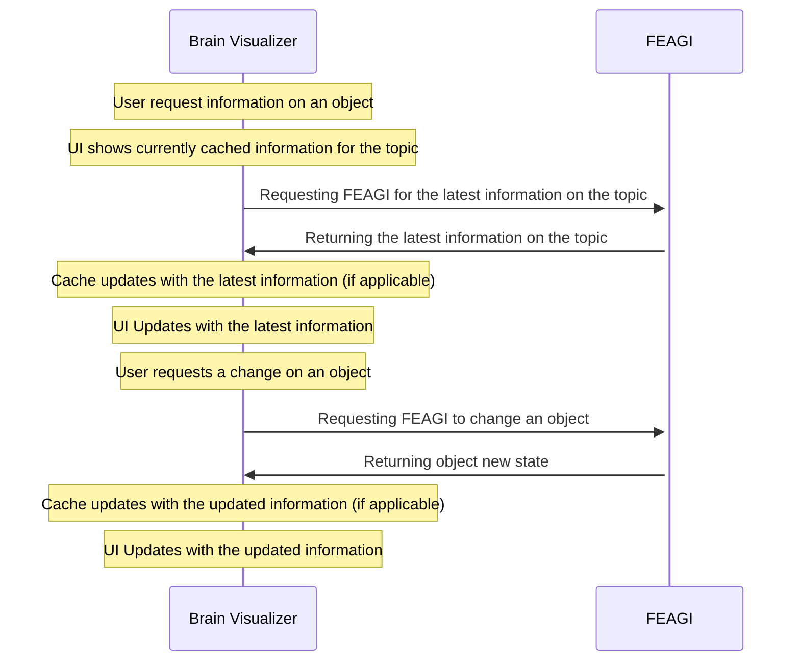
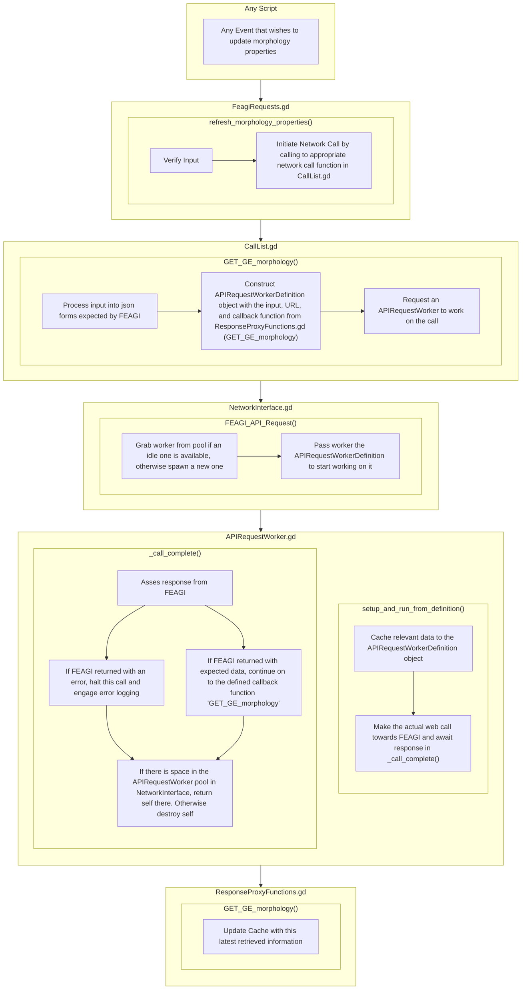

# Summary
FEAGI essentially follows a client-server model, where the main FEAGI instance acts as the only server and the source of truth, and clients interact with the FEAGI instance directly. In this case the web Brain Visualizer, a Godot based component of the "FEAGI Playground" page, behaves as a client that can view details of the current genome loaded into FEAGI, and request changes to be made to it. However, the Brain Visualizer does not do actual processing on its own.

## Technical Overview
The Brain Visualizer (known as BV) on launch requests the general state of the genome. Certain details are cached internally for rapid access, and are updated when FEAGI reports that the resource has been updated.

**The Brain Visualizer can be divided into 2 groups of components:**

- **Core**: Responsibile for exchanging data with FEAGI and storing cached responses for immediate access
- **UI**: All elements the users interacts with. None interact with feagi directly, but rather all read from the Core's cache and make change requests through Core.

In essence, the Core is the 'backend / middleware' and the UI is the 'frontend'.

This division of labor is done since several UI elements all interact with the same data, and having only a single source of truth greatly reduces the chance of desyncs between UI elements, such as between the Brain Monitor and Circuit Builder

The following sections will describe various components in greater detail. It is *suggested* to be familiar with FEAGI concepts such as 'cortical areas' and 'morphologies' before continuing

# Core
The Core is a collection of scripts defining nodes and objects to send requests to FEAGI, process responses from FEAGI, and to cache the retrieved information for use by the UI systems. The Core can be further divided into the following sections:
- **Network**: A system of scripts that manage all network calls toward FEAGI, and do initial processing on all responses
  - HTTP requests (GET, POST, etc) are organized inside BV as functions with converted naming conventions as the actual endpoint call, and these functions each spawn their own web worker to make the call, and await for the response. The pool of workers is dynamic and can expand and shrink as needed to handle spikes in the requests for information
  - Websocket data allows back and forth communication between FEAGI and the BV client. Currently it is used to retrieve neuronal activity data and FEAGI calls to reset the BV state.
  - It is important to note future refactoring of BV is intending to move many network related communications away from web endpoints and towards websocket and webRTC
  - Notable Scripts: FEAGIRequests.gd, FEAGIInterface.gd, NetworkInterface.gd, APIRequestWorker.gd, CallList.gd
- **Cache**: A collection of objects intended to store data retrieved from FEAGI in an accessible manner. 
  - UI elements can never write to the Cache directly, only responses from FEAGI can effect the state of the Cache. 
  - Various objects in Cache have signals that emit when various variables are updated from FEAGI. This is utilized heavily in UI elements to keep information displayed to the user up to date
  - Notable Scripts: ResponseProxyFunctions.gd, FEAGICache.gd, CorticalAreasCache.gd, MorphologiesCache.gd

## Networking

Most networking calls are started by **FeagiRequests**, an autoloaded node / class (name shared) that makes it trivial to request data / change towards FEAGI through appropriately named functions. Functions in this script, following request validation, commences the actual network interaction.

The heart of the networking system lies in the **NetworkInterface** script. This initializes first to grab the FEAGI address and ports being used, initialize the **RequestWorker** pool, and start the websocket connection to FEAGI.
### HTTP Calls

For HTTP calls: Every HTTP endpoint of FEAGI has an equivalent function in the singular shared instance of **CallList** of the same name. Each function takes in any required parameters, and the return function (from a shared instance of **ResponseProxyFunctions**) to run at the end of the call with the HTTP response. each function retrieves the full endpoint URL from **AddressList**, and assembles a **RequestWorkerDefinition**, an object that defines instructions for how the HTTP request is to be processed.
- **RequestWorkerDefinition** defines the type of HTTP call to make (GET, POST, etc), the URL endpoint to use, the parameters to pass, if the endpoint is a single call or should be polled (and if so, until what condition should the endpoint stop being polled). It is essentially a set of instructions, this object does not do anything on its own

The assembled RequestWorkerDefinition is passed to a singular NetworkInterface instance, which is responsible for maintaining a pool of RequestWorkers, nodes that extend off of Godot's own HTTPRequest (TODO link), and that each handle a single HTTP request at a time. The NetworkInterface assigns an available RequestWorker (or will spawn an additional RequestWorker for it if none are available) and passes the RequestWorkerDefinition object.

The RequestWorker then executes the call as defined by the RequestWorkerDefinition

Upon completion of the HTTP call:
- If the response code from the server is **200**, The worker will call the relevant response processing in ResponseProxyFunctions as defined by the RequestWorkerDefinition
- If the response code from the server is **400** , the worker will commence error logging as FEAGI is expected to return a JSON in such cases with the error code and optionally a request for BV to reset / resync its state
- If the response code from the server is **anything else** (this shouldn't happen), the worker will simply log this to the console

Following the above, the worker will return itself to the available worker pool inside the NetworkInterface if there is available space and remain idle, otherwise it will simply delete itself

All response functions defined in ResponseProxyFunctions take the returned data from the RequestWorker and typically update something within the Cache (which itself can fire signals), or fire signals directly, depending on the use case.

Example of a user requesting the latest properties of a Morphology:

### WebSocket
**NOTE: It is important to note this section is set to be refactored**

The websocket runs on a polling basis inside **NetworkInterface**. Upon recieving new data, the data is ran through a switch case to determine the data type.
- If the data is a ping, then it is used to determine the latency to FEAGI
- If it is a reset request, then a reset of BV is initiated (where all cached data of BV is wiped, everything closed, and the system essentially restarts)
- If it is anything else, then it is treated as visualization data to illistrate neuronal activity, which is used in the BM UI section
  

## Cache

The Cache holds information that we may want immediately for the UI. No UI elements may update the cache directly, only read from it. Feagi state changes detected by response proxy functions are the primary writer of data to the Cache

Cache is entirely stored within the **FEAGICache** Autoload node / class (same name). Some information, such as loaded genome name. However, morphology and cortical area details are stored within variables of types **MorphologiesCache** and **CorticalAreasCache** respectfully.

It is important to note that on Brain Visualizer load, it is impractical to grab every single property of every object in the genome right at start-up. Instead, we retrieve *summarized* data from FEAGI which tells us basic information such as the names / positions of cortical areas and the names of morphologies, and mark the generated cached objects as having placeholder data for their finer details. On user lookup of detailed properties of a specific cortical area / morphology, we call for the details of that object and update the cache'd object with the full information, also marking it as no longer placeholder. 

That being said, we continue refresh details from FEAGI on every detail lookup even after the placeholder data has been overwritten with real data to ensure we are up to date. This is critical since this is a multi-user application, and web browsers may pause godot when switching tabs / idle, which means we may miss information of changes to the state of FEAGI.

### Morphology Cache

**MorphologiesCache** stores morphology data as objects under a dictionary, which is key'd by the string name of the morphology in question. The MorphologiesCache object itself has methods for spawning morphology objects and inserting them into its dictionary given output data from FEAGI, as well as removing them. but otherwise simply manages the pool. It 

All morphologies are stored in various morpholgy objects (such as **CompositeMorphology** or **FunctionMorphology**) given the type of morphology they are. All these objects inherit from the **BaseMorphology** class, which contains properties utilized by all morphologies, such as their name. These morphology objects also each include signals that fire when their properties are updated, or if they are about to be deleted. 

A **NullMorphology** object exists simply to be thrown in an error or to act as a stand in for data not yet retrieved.

### Cortical Area Cache

**CorticalAreasCache** stores cortical area data as objects under a dictionary, which is key'd by the cortical ID (A unique identifier string given to every cortical area, generated by FEAGI). Much like MorphologiesCache, this object itself merely handles the pool of cortical area objects.

Again like with morphologies, all cortical area objects are of various class types that inherit from **BaseCorticalArea**. Cortical areas are much larger objects, but in function here operate the same as with morphologies, with information that can be read by the UI, and signals that fire when various properties are updated.

### Mapping Data

Mapping data (what cortical areas are connected to what, and using what morphologies) is cached within the BaseCorticalArea object. Technically it is stored on the afferent cortical area of each connection, in a dictionary key'd by the cortical ID of the efferent end of that connection. The data is stored in the form of an **MappingProperties** object, which itself holds all the individual mappings beween those 2 cortical areas in that direction, with each being stored as a **MappingProperty** object (watch the plural!). MappingProperties itself contains signals for when any internal MappingProperty is updated, it also contains properties describing other details of the mapping as a whole.

However, there is an array of corticalIDs denoting all afferent connections from a cortical area as well. This way, we can see deduce all connections going in or out of a cortical area.

(Following is old)

### UI
UI Elements, such as the bar on the top of the screen, all windows, the Circuit Builder, and the Brain Monitor All read directly from the cache, or directly are updated from FEAGI responses when displaying data.

### Notable Scripts
- FeagiRequests
	- Autoloaded Script to centralize requests towards FEAGI, such as editing cortical areas or modifying morphologies
- FEAGICache
	- Autoloaded Script that holds all cached information about the state of the current genome
- FEAGICacheEvents
	- Autoloaded script that simply holds all signals correlating to FEAGI responses pertaining to cached data.
		- Keep in mind many cache data type objects also have their own signals. FEAGICacheEvents is simply available as an option
- FeagiEvents
	- Autoloaded script that simply holds all signals correlating to FEAGI responses NOT pertaining to cached data.
