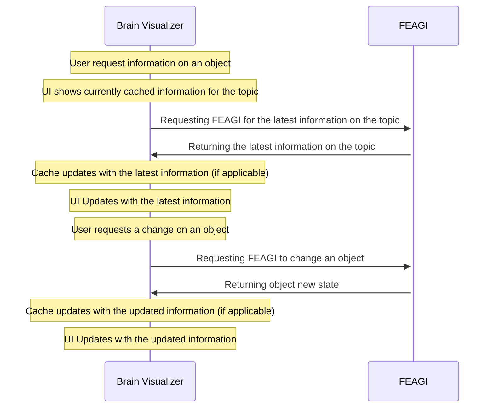

# Summary
FEAGI essentially follows a client-server model, where the main FEAGI instance acts as the only server and the source of truth, and clients interact with the FEAGI instance directly. In this case the web Brain Visualizer, a Godot" based component of the "FEAGI Playground" page, behaves as a client that can view details of the current genome loaded into FEAGI, and request changes to be made to it. However, the Brain Visualizer does not do actual processing on its own.

## Technical Overview
The Brain Visualizer (known as BV) on launch requests the general state of the genome. Certain details are cached internally for rapid access, and are updated when FEAGI reports that the resource has been updated.

The Brain Visualizer can be broken down into various sections

### Networking
The networking library canned be called upon to send and request data to specific FEAGI endpoints, as well as maintain communication to FEAGI via a websocket. Communication can take the form of singular web requests, or polling requests (in which requests are made repeatedly on a timer until a certain condition is met. To ensure scalability for call amounts, a worker system is used to hold, spawn, and destroy workers as needed.

### Cache
Certain information that may be desired immediately is stored on a cache. Such information includes cortical area 2D positions, 3D positions, their names and IDs, and their sizes. Specifics of how these details work depends on the object being cached. One thing to note however is that the User never updates the values in the cache directly. Instead change requests are sent to FEAGI, and only FEAGI's response dictates what values in the cache were updated.

### UI
UI Elements, such as the bar on the top of the screen, all windows, the Circuit Builder, and the Brain Monitor All read directly from the cache, or directly are updated from FEAGI responses when displaying data.

### Notable Scripts
- FeagiRequests
	- Autoloaded Script that allows for easy requests to FEAGI, such as editing cortical areas or modifying morphologies
- FEAGICache
	- Autoloaded Script that holds all cache information
- FEAGICacheEvents
	- Autoloaded script that simply holds all signals correlating to FEAGI responses pertaining to cached data.
		- Keep in mind many cache data type objects also have their own signals. FEAGICacheEvents is simply available as an option
- FeagiEvents
	- Autoloaded script that simply holds all signals correlating to FEAGI responses NOT pertaining to cached data.
