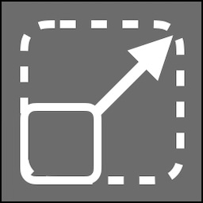

# Brain Monitor

The Brain Monitor is a real-time 3D visualization system that displays your genome as volumetric structures with live neural activity. It provides an immersive way to understand your neural architecture and watch your artificial brain in action.

## Overview

Brain Monitor renders cortical areas as 3D volumes positioned in space. As neurons fire, you'll see visual indicators showing the activity patterns throughout your genome. This provides intuitive insight into how information flows through your neural circuits.

## Interface Components

### 3D Viewport

The main area displays:
- **Cortical Volume Meshes**: 3D boxes representing cortical areas
- **Neural Activity**: Colored highlights showing neuron firing
- **Connection Lines**: Visual indicators of mappings between areas
- **Region Boundaries**: Spatial organization of brain circuits
- **Grid Floor**: Optional reference grid for spatial orientation

### Camera Controls

The camera allows free movement through 3D space:
- **Orbit**: Rotate around a point of interest
- **Pan**: Move laterally through space
- **Zoom**: Move closer or farther from objects
- **Focus**: Automatically frame specific objects

### Activity Indicators

Neural activity is visualized through:
- **Color Intensity**: Brightness indicates firing strength
- **Spatial Distribution**: Shows which voxels are active
- **Temporal Dynamics**: Activity changes in real-time
- **Connection Flow**: Lines show active pathways

## Basic Navigation

### Mouse Controls

**Rotation (Orbit)**
- **Left mouse drag**: Rotate the camera around the focus point
- The camera orbits while keeping the center of interest in view

**Pan (Move Laterally)**
- **Middle mouse drag**: Move left/right/up/down
- **Shift + Left mouse drag**: Alternative pan control
- Useful for repositioning view without rotating

**Zoom**
- **Mouse wheel scroll**: Zoom in (scroll up) or out (scroll down)
- **Right mouse drag**: Alternative zoom (drag up/down)
- Get closer to see details or pull back for overview

**Focus on Object**
- **Click on cortical area**: Click a volume to focus on it
- Camera smoothly transitions to frame the object
- Useful for quick navigation to specific areas

### Keyboard Controls

- **W/S**: Move forward/backward
- **A/D**: Move left/right
- **Q/E**: Move up/down
- **Arrow Keys**: Pan view
- **F**: Focus on selected object
- **Home**: Reset to default view

See [Camera Controls](camera_controls.md) for advanced navigation.

## Understanding Visual Elements

### Cortical Area Volumes

Each cortical area appears as a 3D box with:

**Size and Position:**
- Dimensions reflect the cortical area's voxel dimensions
- Position reflects 3D coordinates in the genome
- Larger areas contain more neurons

**Activity Visualization:**
- Active neurons highlight within the volume
- Color intensity shows firing rate
- Spatial patterns show which regions are processing

### Connection Lines

When hovering over or selecting a cortical area:
- **Outgoing connections**: Lines from this area to others
- **Incoming connections**: Lines from other areas to this
- **Connection strength**: Line thickness or opacity
- **Connection type**: Color or style variations

### Brain Circuits

Regions organize cortical areas spatially:
- Dotted or wireframe boundaries (optional)
- Hierarchical nesting of sub-circuits
- Helps understand organizational structure

## Interacting with Objects

### Selection

**Single Selection:**
- **Click** on a cortical area to select it
- Selected area highlights with an indicator
- Properties panel updates (if visible)

**Multi-Selection:**
- **Ctrl + Click** to add to selection
- Useful for comparing multiple areas
- Some operations work on multiple objects
- In 3D, **Ctrl + Click** now toggles cortical areas for shared multi-edit quick menu actions

**Plane Focus Shortcuts:**
- **Ctrl + 1 + Click**: Focus clicked cortical area on XY plane
- **Ctrl + 2 + Click**: Focus clicked cortical area on XZ plane
- **Ctrl + 3 + Click**: Focus clicked cortical area on YZ plane

### Quick Menu

**Right-click** on a cortical area to access context menu:
- Details - View/edit properties
- Quick Connect - Create connections
- Clone - Duplicate area
- Move 3D - Activate 3D gizmo for positioning
- Resize 3D - Activate 3D gizmo for resizing
- Add to Region - Move to different region
- Reset - Clear neural state
- Delete - Remove area

See [Quick Menu](quick_menu.md) for complete details.

### Hovering

**Hover** over a cortical area to:
- See all connections highlighted
- View tooltip with area information
- Temporarily highlight connected areas
- Understand data flow at a glance

## Viewing Neural Activity

### Activity Display Modes

Neural activity can be visualized in different ways:

**Voxel-Level Activity**
- Individual voxels light up when neurons fire
- Spatial patterns emerge showing processing
- Color intensity indicates firing strength

**Area-Level Activity**
- Entire cortical area glows based on average activity
- Quickly see which areas are active
- Useful for high-level understanding

**Connection Activity**
- Connection lines pulse or glow when data flows
- Shows information pathways
- Helps debug connectivity issues

### Global Neural Connections Toggle

Use the **Activity Rendering Toggle** in the top toolbar:
- **Enable**: Show all connections globally
- **Disable**: Show connections only on hover
- Useful for understanding overall architecture
- Can be visually overwhelming with many connections

## Camera Features

### Camera Animations

Record and play camera paths for:
- Demonstrations and presentations
- Consistent viewpoints for comparisons
- Documentation and screenshots
- Guided tours of complex genomes

See [Camera Animations](camera_animations.md) for detailed instructions.

### Saved Viewpoints

Quickly return to important views:
1. Position camera at desired viewpoint
2. Save camera animation with single frame
3. Play animation to instantly return

### Focus Operations

**Focus on Cortical Area:**
1. Select area in Circuit Builder OR Brain Monitor
2. Press **F** key OR use dropdown in top toolbar
3. Camera smoothly frames the object

**Focus on Brain Circuit:**
1. Use **Circuits** dropdown in top toolbar
2. Select a circuit
3. Camera focuses on that region's contents

## Advanced Features

### 3D Gizmos

Manipulate objects directly in 3D space:

**Move Gizmo:**

1. Right-click cortical area → **Move 3D**
2. Colored arrows appear (X=Red, Y=Green, Z=Blue)
3. Click and drag arrows to move along that axis
4. Click central sphere to move freely

**Resize Gizmo:**

1. Right-click cortical area → **Resize 3D**
2. Colored handles appear on box corners and edges
3. Drag to resize along specific dimensions
4. Only available for areas that allow dimension editing

### Indicator Flashing

When navigating from top toolbar dropdowns:
- Selected object flashes briefly
- Helps locate object in busy scenes
- Visual confirmation of focus target

### Region Visualization

**3D Brain Monitor Tabs for Regions:**
1. Right-click region in Circuit Builder
2. Select **Open 3D Tab**
3. Opens dedicated 3D view for that region
4. Isolates region for focused work

## Split View Workflow

Best practice: Use Brain Monitor alongside Circuit Builder

**Setting Up Split View:**
1. Right-click brain circuit
2. Select **Open 3D Tab**
3. Circuit Builder and Brain Monitor appear side-by-side

**Benefits:**
- See 2D topology and 3D spatial layout simultaneously
- Selection syncs between views
- Edit in one, visualize in the other
- Different perspective aids understanding

See [Split View](split_view.md) for more details.

## Performance Considerations

### Optimizing Display

For large genomes:
- **Hide connections** when not needed (toggle off global connections)
- **Focus on sub-circuits** instead of viewing entire genome
- **Reduce activity rendering** if performance suffers
- **Close unused tabs** to free resources

### Activity Update Rate

Neural activity updates at the burst rate frequency:
- Higher burst rates = more frequent updates
- Lower rates reduce visual updates but save performance
- Adjust burst rate in top toolbar if needed

## Visual Customization

### Camera Settings

Adjust camera behavior in Options:
- Movement speed
- Rotation sensitivity
- Zoom speed
- Inertia and smoothing

### Display Options

Configure what's visible:
- Grid floor on/off
- Connection lines always/hover/never
- Activity rendering quality
- Transparency effects

Access via **Options** menu in top toolbar.

## Common Workflows

### Monitoring Neural Activity

1. Open Brain Monitor (use Split View)
2. Ensure burst rate > 0 Hz
3. Watch cortical areas light up as they process
4. Hover areas to see their connections
5. Look for unexpected patterns or dead zones

### Exploring Genome Structure

1. Start with overview (zoom out to see all)
2. Identify major regions and their spatial layout
3. Focus on specific circuits of interest
4. Examine connections between areas
5. Navigate through regional hierarchy

### Debugging Connections

1. Select source cortical area
2. Note outgoing connections (lines)
3. Verify expected targets are connected
4. Check for unexpected connections
5. Edit mappings if needed

### Creating Documentation

1. Position camera for best view
2. Use camera animations to save position
3. Take screenshots (system screenshot tool)
4. Record camera animations for demos
5. Share viewpoints with team

## Troubleshooting

**"No activity showing"**
- Check burst rate is above 0 Hz
- Verify FEAGI is processing data
- Ensure cortical areas have input connections
- Check activity rendering is enabled

**"Can't see my cortical areas"**
- Zoom out to get overview
- Use Circuits dropdown to focus on regions
- Check you're in correct region tab
- Verify areas exist in FEAGI

**"Camera movement is too fast/slow"**
- Adjust camera speed in Options
- Use different navigation methods (keyboard vs mouse)
- Reset camera settings to defaults

**"Performance is poor"**
- Disable global neural connections
- Focus on smaller regions
- Close unnecessary tabs
- Reduce activity rendering quality

**"Lost my position"**
- Use camera animations to save important views
- Use Focus (F key) to return to selected object
- Use Circuits dropdown for quick navigation

## Tips for Effective Monitoring

1. **Use Split View**: See structure and activity simultaneously
2. **Name Areas Clearly**: Helps identify volumes in 3D space
3. **Organize Spatially**: Position related areas near each other
4. **Save Camera Positions**: Record important viewpoints
5. **Watch for Patterns**: Look for expected vs unexpected activity
6. **Check Connections**: Hover to verify data flow paths
7. **Explore Regions**: Navigate hierarchically for large genomes
8. **Monitor Performance**: Adjust settings if visualization slows

## Integration with Circuit Builder

Brain Monitor and Circuit Builder work together:
- **Synchronized Selection**: Click in one, highlights in both
- **Synchronized Focus**: Focus operations affect both views
- **Complementary Perspectives**: 2D graph + 3D spatial
- **Cross-Navigation**: Jump between views seamlessly

Use both views to fully understand your genome's structure and behavior.

## Related Topics

- [Circuit Builder](circuit_builder.md) - 2D graph companion view
- [Neural Activity](neural_activity.md) - Understanding neuron firing
- [Camera Controls](camera_controls.md) - Advanced navigation
- [Camera Animations](camera_animations.md) - Recording viewpoints
- [Split View](split_view.md) - Side-by-side workflow
- [Navigation Basics](navigation.md) - Basic movement controls

[Back to Overview](index.md)
