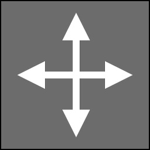

# Cortical Areas

Cortical areas are the fundamental building blocks of your genome. Each cortical area is a 3D volume of neurons that processes information, stores patterns, or interfaces with the external world.

## What is a Cortical Area?

A cortical area is a structured group of neurons organized in a 3D grid (measured in voxels). Each voxel can contain one or more neurons. Cortical areas:

- Process incoming signals from connected areas
- Generate outputs based on their internal state and connections
- Learn and adapt through synaptic changes
- Specialize in different types of processing

## Types of Cortical Areas

Brain Visualizer supports several types of cortical areas, each with specific purposes:

### Input Processing Unit (IPU)

**Purpose**: Receive data from external sources (sensors, cameras, etc.)

**Characteristics:**
- **Color**: Dark Gray
- **Interface**: Connected to embodiment devices
- **Configuration**: Based on device templates (vision, audio, text, etc.)
- **Dimensions**: Determined by device type and count

**Common Uses:**
- Visual input from cameras
- Audio input from microphones  
- Sensor data (temperature, distance, etc.)
- Text or symbolic input
- Controller input (keyboard, gamepad)

### Output Processing Unit (OPU)
**Purpose**: Send data to external actuators (motors, displays, etc.)

**Characteristics:**
- **Color**: Orange
- **Interface**: Connected to embodiment devices
- **Configuration**: Based on device templates (motor, display, etc.)
- **Dimensions**: Determined by device type and count

**Common Uses:**
- Motor control (movement, rotation)
- Display output (text, graphics)
- Audio output (speech, sounds)
- Control signals (on/off, analog values)

### Memory
**Purpose**: Store and recall patterns for learning and reference

**Characteristics:**
- **Color**: Dark Red
- **Function**: Pattern recognition and recall
- **Behavior**: Learns associations between inputs
- **Dimensions**: User-configurable

**Common Uses:**
- Short-term memory
- Long-term pattern storage
- Associative recall
- Context maintenance

### Custom (Interconnect)
**Purpose**: Internal processing and transformation

**Characteristics:**
- **Color**: Blue
- **Function**: General-purpose neural processing
- **Behavior**: Transforms inputs to outputs
- **Dimensions**: User-configurable

**Common Uses:**
- Feature extraction
- Pattern transformation
- Decision making
- Intermediate processing layers
- Custom neural algorithms

### Core
**Purpose**: System-level processing (advanced)

**Characteristics:**
- **Color**: Dark Blue
- **Function**: Specialized system operations
- **Behavior**: FEAGI internal processing
- **Dimensions**: System-defined

**Note**: Core areas are typically created by FEAGI itself and rarely created manually.

## Creating Cortical Areas

### Method 1: Quick Access (IPU/OPU)

For input and output areas:

1. Click **Inputs** or **Outputs** in the top toolbar
2. Click the **+** button
3. Select a template (e.g., Vision, Motor)
4. Configure:
   - **Device Count**: How many instances (e.g., 2 cameras)
   - **Unit ID**: Unique identifier for the device
   - **Location**: 3D position in genome
   - **Data Type**: How data is encoded
5. Click **Add**

The new area appears in both Circuit Builder and Brain Monitor.

### Method 2: Create from Circuit Builder

For all types:

1. Right-click empty space in Circuit Builder
2. Select **Create Cortical Area**
3. Choose type:
   - Click **Input** for IPU
   - Click **Output** for OPU
   - Click **Interconnect** for Custom
   - Click **Memory** for Memory
4. Configure properties
5. Click **Add**

### Method 3: Clone Existing Area

Duplicate an area with similar settings:

1. Right-click existing cortical area
2. Select **Clone**
3. Modify name and properties as needed
4. Click **Clone**

## Configuring IPU/OPU Areas

### Templates

IPU and OPU areas use **templates** that define their structure:

**Common IPU Templates:**
- **Vision**: Camera input (2D image data)
- **Audio**: Microphone input (frequency bands)
- **Text Input**: Character or word data
- **Generic Sensor**: Numerical sensor data
- **Controller**: Button/joystick input

**Common OPU Templates:**
- **Motor**: Servo or motor control
- **Display**: Text or graphics output
- **Audio Output**: Sound generation
- **Generic Actuator**: Numerical control signals

### Device Count

Specifies how many instances of the device exist:

- **1 camera** = single vision IPU
- **2 cameras** = stereo vision (two separate IPUs or one multi-unit IPU)
- **4 motors** = four separate motor OPUs

Each count creates the appropriate cortical structure.

### Unit ID

Unique identifier connecting the cortical area to physical/virtual hardware:

- Must match the ID used by your embodiment controller
- Allows FEAGI to route data to/from correct devices
- Required for IPU/OPU areas

### Data Type Configuration

Determines how data is encoded:

**For IPU (Input):**
- **Signed Percentage**: Normalized -100% to +100%
- **Unsigned Percentage**: Normalized 0% to 100%
- **Absolute Values**: Raw numeric values
- **Binary**: On/off states

**For OPU (Output):**
- Similar encoding options
- Must match what the embodiment expects

### Frame Handling

For vision IPU areas:

- **Single Frame**: Process one frame at a time
- **Frame Stack**: Stack multiple frames for temporal awareness
- **Differential**: Process frame-to-frame changes

### Positioning

How multi-unit data is arranged spatially:

- **Stack XYZ**: Stack along specific axis
- **Grid**: Arrange in 2D grid
- **Linear**: Arrange in line

## Configuring Custom/Memory Areas

### Dimensions

Set the 3D size of the cortical area:

- **X, Y, Z**: Dimensions in voxels
- **Total neurons**: X × Y × Z × neurons per voxel
- Larger areas = more neurons = more processing capacity

**Example:**
- 10 × 10 × 10 = 1,000 voxels
- If 1 neuron per voxel = 1,000 neurons
- If 10 neurons per voxel = 10,000 neurons

### Position

3D location in the genome:

- **X, Y, Z**: Coordinates in 3D space
- Position is organizational (doesn't affect processing)
- Group related areas nearby for clarity

### Neurons Per Voxel

How many neurons exist in each voxel:

- **1**: Single neuron per voxel (typical)
- **Higher values**: Multiple neurons per voxel (advanced)
- Affects total neuron count and processing

### Morphology

Default morphology for connections:

- **Pattern**: Defines connection structure
- **Parameters**: Shape and density
- Can be overridden per connection

See [Morphologies](morphologies.md) for details.

## Viewing and Editing Properties

### Basic Properties Window

Right-click area → **Details** to view/edit:

**General Tab:**
- Name (friendly name for identification)
- Cortical ID (unique identifier, read-only)
- Type (IPU, OPU, Memory, Custom, Core)
- Dimensions (X, Y, Z)
- Position (X, Y, Z)
- Parent region

**Statistics Tab:**
- Neuron count (current / total)
- Active neuron count
- Synapse count
- Memory usage

**Connections Tab:**
- Incoming connections (afferent)
- Outgoing connections (efferent)
- Recursive connections
- Quick navigation to connected areas

### Advanced Properties

For advanced users:

- Neuron parameters
- Learning rates
- Activation functions
- Plasticity settings
- Neurotransmitter properties
- Hebbian learning configuration

Access via **Advanced** button in Properties window.

## Organizing Cortical Areas

### Naming Conventions

Use clear, descriptive names:

**Good:**
- "Vision_Left_Camera"
- "Motor_Front_Left_Wheel"
- "Memory_Visual_Patterns"
- "Custom_Edge_Detection"

**Avoid:**
- "CA_001"
- "Untitled"
- "Test"

### Grouping with Regions

Organize related areas into brain regions:

1. Select cortical areas to group
2. Right-click → **Create Region**
3. Name the region descriptively
4. Areas move into the new region

See [Brain Regions](brain_regions.md) for more details.

### Spatial Organization

In Brain Monitor (3D), position areas logically:

- **Inputs**: One side or top
- **Processing**: Middle layers
- **Memory**: Central or dedicated zone
- **Outputs**: Opposite side from inputs

Organized layout aids understanding and debugging.

## Connecting Cortical Areas

Cortical areas become functional when connected:

### Creating Connections

1. **In Circuit Builder**: Drag from output port to input port
2. **Quick Connect**: Right-click → Quick Connect → choose destination
3. **Mapping Editor**: Specify morphology and parameters

See [Mapping Connections](mapping_connections.md) for complete guide.

### Connection Types

- **Feedforward**: Input → Processing → Output (typical)
- **Feedback**: Higher layer → Lower layer (modulation)
- **Lateral**: Same-level areas (integration)
- **Recursive**: Area to itself (temporal)

### Best Practices

1. **Start Simple**: Connect inputs to outputs with one processing layer
2. **Test Incrementally**: Add connections and test behavior
3. **Avoid Over-Connection**: Not everything needs to connect to everything
4. **Use Appropriate Morphologies**: Match connection patterns to function
5. **Document**: Name connections and regions to clarify intent

## Common Operations

### Renaming

1. Right-click area → **Details**
2. Edit the name field
3. Press Enter or click away to save

### Moving (2D Position)

**In Circuit Builder:**
- Drag the node to new position
- Position saves automatically after brief delay

**Via Menu:**
- Right-click → **Relocate 2D**
- Enter exact X, Y coordinates

### Moving (3D Position)

**Via Menu:**
- Right-click → **Move 3D**
- Drag colored arrows in 3D view
- X=Red, Y=Green, Z=Blue

**Via Properties:**
- Right-click → **Details**
- Edit position X, Y, Z values
- Click Apply

### Resizing

For Custom and Memory areas:

**Via 3D Gizmo:**
- Right-click → **Resize 3D**
- Drag corner/edge handles in 3D view

**Via Properties:**
- Right-click → **Details**
- Edit dimensions X, Y, Z
- Click Apply

**Note:** IPU/OPU dimensions are determined by templates and cannot be directly resized.

### Cloning

Create a copy with similar settings:

1. Right-click → **Clone**
2. Modify name (required)
3. Adjust position/dimensions if needed
4. Click **Clone**

Connections are NOT cloned (area starts unconnected).

### Resetting

Clear all neural state (neuron values, learning):

1. Right-click → **Reset**
2. Confirm the reset
3. Area returns to initial state

Useful for:
- Starting fresh after testing
- Clearing corrupted state
- Beginning new training

### Deleting

Remove a cortical area permanently:

1. Right-click → **Delete**
2. Review confirmation (shows affected connections)
3. Confirm deletion

**Warning:** This removes all connections to/from the area. Cannot be undone.

## Monitoring Cortical Area Activity

### In Brain Monitor

Active cortical areas light up:
- **Bright spots**: Highly active neurons
- **Patterns**: Spatial activity distribution
- **Changes**: Real-time updates

Hover over area to see its connections.

### Activity Indicators

- **Color Intensity**: Firing rate
- **Spatial Patterns**: Which voxels are active
- **Temporal Patterns**: How activity changes over time

### Debugging

If area isn't showing expected activity:

1. **Check Connections**: Verify inputs are connected
2. **Check Input Activity**: Ensure upstream areas are active
3. **Check Mappings**: Verify morphologies are correct
4. **Check Data Flow**: Trace from inputs through processing
5. **Check Configuration**: Verify area settings are correct

## Performance Considerations

### Neuron Count Limits

Your genome has a maximum neuron count:
- Check current vs max in top toolbar
- Creating large areas consumes budget
- Balance size vs. quantity

### Planning Capacity

Before creating areas:
1. Estimate neurons needed per area
2. Calculate total neurons
3. Ensure within genome limits
4. Adjust dimensions if needed

### Optimization Tips

- **Start small**: Create minimal areas, expand if needed
- **Use templates efficiently**: IPU/OPU sizes match data dimensions
- **Memory areas**: Size based on pattern storage needs
- **Custom areas**: Optimize for actual processing requirements

## Troubleshooting

**"Can't create IPU/OPU"**
- Ensure template is selected
- Verify unit ID is unique
- Check neuron count limit isn't exceeded

**"Area not visible"**
- Use Fit All in Circuit Builder
- Focus using top toolbar dropdowns
- Check area is in expected region

**"No activity showing"**
- Verify area has input connections
- Check upstream areas are active
- Ensure burst rate > 0 Hz
- Verify FEAGI is processing

**"Can't resize area"**
- IPU/OPU dimensions are template-defined
- Check if area type allows resizing
- Use Properties window for precise control

**"Neuron count exceeded"**
- Reduce area dimensions
- Delete unused areas
- Increase genome neuron limit (if possible)

## Related Topics

- [Cortical Area Types](cortical_area_types.md) - Detailed type information
- [Mapping Connections](mapping_connections.md) - Connecting areas
- [Morphologies](morphologies.md) - Connection structures
- [Brain Regions](brain_regions.md) - Organizing areas
- [Circuit Builder](circuit_builder.md) - 2D editing interface
- [Brain Monitor](brain_monitor.md) - 3D visualization
- [Quick Menu](quick_menu.md) - Context operations

[Back to Overview](index.md)
