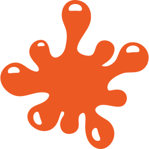
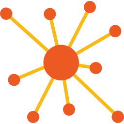
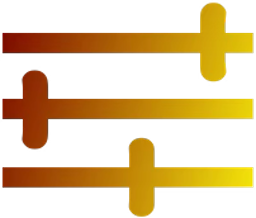

# Cortical Areas

Cortical areas are the fundamental building blocks of your genome. Each cortical area is a 3D volume of neurons that processes information, stores patterns, or interfaces with the external world.

## What is a Cortical Area?

A cortical area is a structured group of neurons organized in a 3D grid (measured in voxels). Each voxel can contain one or more neurons. Cortical areas:

- Process incoming signals from connected areas
- Generate outputs based on their internal state and connections
- Learn and adapt through synaptic changes
- Specialize in different types of processing

## Types of Cortical Areas

Brain Visualizer supports several types of cortical areas, each with specific purposes:

### Input Processing Unit (IPU)

An input area is where the outside world enters the genome. A controller, camera, microphone, or sensor writes into it. Neurons there then connect onward to memory and interconnect areas.

**Color**: Dark gray in Circuit Builder.

The size is fixed by the template. You choose a template in **Add Input Cortical Area**, then set how many devices you have and, when the template allows it, the per-device width, height, and depth. Extra devices repeat that width along X. Height and depth stay the size of one device.

**How a value is encoded**

The controller does not write a raw number into the area. It turns the reading into neurons. Decoding is the same map run backwards: which neurons fired, and how strongly, becomes the number, pixel, or token again.

- **Linear percentage.** One neuron fires along Z, and its firing strength is full. Z 0 is the top of the range. The last Z is the bottom. A deeper area splits the same range into finer steps. Nothing firing reads back as zero. Use this when you want one obvious "the value is here" neuron.
- **Fractional percentage.** Several Z neurons can fire at once. Z 0 is one half, Z 1 is one quarter, Z 2 is one eighth, and each later plane is half of the one before it. The value is the sum of the planes that fired. Zero uses only the last plane. Use this when a single reading should look like a small pattern instead of one spike.
- **Unsigned** is 0 to 100%. **Signed** on one column runs from full negative at the far Z, through stopped in the middle, to full positive at Z 0. Some signed devices instead use two neighboring columns, one for the positive amount and one for the negative amount.
- **Absolute** is the reading or command right now. **Incremental** is a change. Where a template allows incremental, X grows into an increase column and a decrease column for each axis.
- **Pictures.** One neuron per pixel per color channel. X and Y are the pixel, with the origin at the top left. Z is the channel. Firing strength is that channel's brightness.
- **Sound.** One neuron per frequency column. X is the frequency. Y is the phase step. Firing strength is loudness on the decibel scale registered with the device. Strength 0 is silence and emits no neuron.
- **Text.** One token per tick, only at x = 0, y = 0. Each Z plane is one bit, and Z 0 is the highest bit. Any strength above 0 turns that bit on. The stored integer is the token id plus one, so a completely quiet frame means "no token," not token zero.

**Input templates**

#### Simple Vision

Use this for a camera, a screen capture, or any picture the brain should see as an image.

Encoded as a picture. The default is 128 wide, 128 tall, and 3 channels. Width and height are the resolution you set. Depth stays inside the template range because it is the color channels, not a free measurement axis.

#### Segmented Vision

Use this when the center of the view matters more than the edges, the way a fovea does. Attention and gaze can sit on the sharp middle while the surround stays cheap.

Encoded as nine pictures from one frame. The center is high resolution. The eight surrounding areas are lower resolution. Each of those nine is still a picture: pixel position on X and Y, channel on Z, brightness as firing strength.

#### Depth Map

Use this for a depth camera or lidar image, when the brain needs distance per pixel rather than color.

Encoded as one layer. X and Y are the sensor canvas. Firing strength is normalized depth, from just above 0 up to 1. Strength 0 means no return, not "touching the sensor."

#### Object Segmentation

Use this when an upstream vision model has already named the pixels: road, person, cup. The brain receives labels, not raw color.

Encoded as one layer. X and Y are the source pixel. Firing strength is (class id + 1) divided by the number of classes. Strength 0 means unlabeled. Decoding multiplies that strength by the class count and subtracts one to recover the class.

#### Audio Input

Use this for a microphone or any PCM stream you want the brain to hear as pitch and loudness, not as a waveform sample list.

Encoded as a spectrum for one tick. X is the frequency column. A linear layout is one column per FFT bin from 0 Hz to the Nyquist frequency, which is what you need if something downstream should rebuild the waveform. Y is the phase step. One Y row carries loudness only. Firing strength maps amplitude onto the registered decibel floor and ceiling. Below the floor, that column stays silent. A second device index is the other stereo channel.

#### Text Input (English)

Use this to feed a token stream, one token each tick, such as words already converted to token ids.

Encoded as bits along Z at a single voxel column. The default depth is 16 planes, which is enough for a typical language-model vocabulary once the id is offset by one. A quiet area is a gap between tokens. It is not the token whose id is 0.

#### Count Input

Use this for a single quantity: a score, a remaining count, a number of objects.

Encoded as one unsigned percentage, absolute only. Depth is how many steps that 0% to 100% range is split into. The default depth is 10.

#### Infrared Sensor, Proximity Sensor, Battery Sensor, Shock sensor, Servo Encoder

Use these for one scalar from a device. Infrared and proximity are distance. Battery is charge level. Shock is a pain or impact signal for training. Servo Encoder is the measured position of an actuator, so the brain can see where the joint actually is.

Each is one unsigned percentage. X and Y stay 1. Depth is the resolution of that percentage. Servo Encoder defaults to 20 steps. The others default to 10.

#### Analog GPIO Sensor

Use this for a bank of analog pins, such as the analog inputs on a board, where each pin is its own reading.

Encoded as a grid. X and Y pick the pin. The default grid is 8 by 8. Each pin's percentage is then encoded along Z. The default depth is 1, which cannot split a range, so raise depth in Advanced when the pin value needs more than a single step.

#### Digital GPIO Sensor

Use this for a pin that is only on or off: a switch, a bump sensor, a digital line.

Encoded as a Boolean. A firing neuron is on. Silence is off. The size stays 1 x 1 x 1.

#### Raw IMU

Use this when you want the raw motion sensors, not a fused orientation. Acceleration, rotation rate, and magnetic field stay separate so the brain can learn each.

Encoded as three areas. In order they are accelerometer, gyroscope, and magnetometer. Each area is three signed axes on X, and the signed percentage of that axis is encoded along Z. The default depth is 10.

#### Smart IMU

Use this when the device, or the controller, has already fused the sensors into an orientation.

Encoded as one area with four signed axes on X: w, x, y, and z of the unit quaternion. Each axis is a signed percentage along Z. The default depth is 10.

#### Cartesian Position Sensor

Use this for an absolute place in a workspace you define: a hand, a tool tip, a marker. It is the sensor side of a Spatial Pointer that is in absolute mode.

Encoded as three unsigned percentages on X, one each for x, y, and z. Each axis runs from 0% to 100% of that workspace axis. The value is encoded along Z. Absolute only. The default depth is 100, so each axis has a fine step.

#### Miscellaneous Input

Use this when the data does not match a template above and you will define the meaning yourself in the controller.

FEAGI does not assign a sensor meaning. Width, height, and depth can each change inside the template limits. Whatever layout you choose on the way in is the layout a reader has to use on the way out.

### Output Processing Unit (OPU)

An output area is where the genome leaves the brain. Firing here is what a motor, display, speaker, or other actuator reads.

**Color**: Orange in Circuit Builder.

You choose a template in **Add Output Cortical Area**. Size rules match inputs: the template sets the shape, device count repeats width along X, and only the axes the template leaves open can be edited.

Decoding uses the same layouts as encoding. The controller looks at which neurons fired and rebuilds the command. A quiet output is a zero command, a blank image, or no token, depending on the template.

**Output templates**

#### Rotary Motor

Use this for a wheel, a propeller, or any actuator that takes a signed speed rather than a target angle.

Decoded as one signed percentage on a single column. Z 0 is full forward. The far Z is full reverse. The middle of Z is stopped. Depth is the number of speed steps. The default depth is 9. Width and height stay 1.

#### Positional Servo

Use this for a joint that should go to a position between two mechanical stops, and that can also take a speed limit.

Decoded as an unsigned percentage, 0% to 100% of the travel. Absolute mode is the target position. Incremental mode is motion instead of a target, on two X columns. A third area carries the per-channel speed limit, also an unsigned percentage. Depth is the position resolution. The default depth is 20.

#### Gaze Control

Use this to tell a camera or a segmented-vision pipeline where to look and how wide that look is.

Decoded as two areas. One is the XY center of gaze, a 2D percentage. The other is the relative size of the attended region, a single unsigned percentage. The center defaults to an 8 by 8 grid.

#### Simple Vision

Use this when the brain should paint an image: a display, a "what I am imagining" view, or a camera-like output another program can show.

Decoded as a picture, the same way Simple Vision input is encoded. X and Y are the pixel. Z is the color channel. Firing strength is brightness. The default is 128 x 128 x 3.

#### Image Enhancements

Use this to drive image sliders rather than pixels: how much frame-to-frame change to keep, and how bright or contrasty the picture should be.

Decoded as three columns on X: difference, brightness, and contrast. Z is the slider position, and Z 0 is the top of the range. Absolute mode is one column per slider. Incremental mode is six columns, an increase and a decrease for each slider. The default depth is 10.

#### Object Segmentation

Use this when the brain has decided a class for each pixel and a display or a robot should read those labels.

Decoded the same way as Object Segmentation input. One layer. Firing strength is (class id + 1) divided by the class count. Strength 0 is unlabeled.

#### Pose Estimation

Use this when the brain should report a skeleton: where each joint is in the image, and how sure that report is.

Decoded per joint. Z is the joint id, so the depth is the number of joints in the pose schema. The default depth is 17, a common human-body set. Inside one Z layer, the cluster of firing on X and Y is the joint location, normalized from 0 to 1 across the plane. Confidence is the average firing strength of that cluster. No coherent cluster means that joint was not detected.

#### Audio Output

Use this when firing should become sound: a speaker, a tone, or a check that the brain preserved what Audio Input heard.

Decoded with the same spectrum layout as Audio Input. X is frequency, Y is phase, firing strength is loudness on the registered decibel scale. If several phase rows fire in one frequency column, the strongest strength wins and the others are ignored. Strength 0 stays silent.

#### Text Output (English)

Use this when the brain should emit tokens, one per tick, for a display or a speech step.

Decoded with the same bit planes as Text Input. Bits at x = 0, y = 0, Z 0 as the highest bit. The integer on the planes is the token id plus one. A quiet area emits no token.

#### Count Output

Use this for a single number the brain should report: a chosen class count, a score, a magnitude.

Decoded as one unsigned percentage, absolute only. Depth is the number of steps from 0% to 100%. The default depth is 10.

#### Spatial Pointer

Use this to point at a place in a 3D workspace, or to nudge that point. Pair absolute mode with a Cartesian Position Sensor when you want the command and the measurement in the same units.

Absolute mode is three X columns, x, y, and z, each an unsigned percentage of the workspace, encoded along Z. Incremental mode is six X columns, increase and decrease for each axis, and the value is a signed motion. Zero means no motion. The default depth is 10.

#### Angular Pointer

Use this for a heading: yaw, pitch, and roll. A gimbal, a gaze in angles, or a body orientation command.

Both modes are signed, from -1 to 1 on each axis, with 0 as center or no motion. Absolute mode is three X columns, one per axis, and low Z is +1 while high Z is -1. Incremental mode is six columns, increase and decrease for yaw, pitch, and roll. The default depth is 10.

#### Miscellaneous Output

Use this when the actuator does not match a template and the controller will interpret the voxels itself.

Same rule as Miscellaneous Input. FEAGI does not assign a meaning. The width, height, and depth you set are the contract between the brain and the controller.

### Memory

**Purpose**: Store and recall patterns for learning and reference

**Characteristics:**
- **Color**: Dark Red
- **Function**: Pattern recognition and recall
- **Behavior**: Learns associations between inputs
- **Dimensions**: User-configurable

**Common Uses:**
- Short-term memory
- Long-term pattern storage
- Associative recall
- Context maintenance

### Custom (Interconnect)

**Purpose**: Internal processing and transformation

**Characteristics:**
- **Color**: Blue
- **Function**: General-purpose neural processing
- **Behavior**: Transforms inputs to outputs
- **Dimensions**: User-configurable

**Common Uses:**
- Feature extraction
- Pattern transformation
- Decision making
- Intermediate processing layers
- Custom neural algorithms

### Core
**Purpose**: System-level processing (advanced)

**Characteristics:**
- **Color**: Dark Blue
- **Function**: Specialized system operations
- **Behavior**: FEAGI internal processing
- **Dimensions**: System-defined

**Note**: Core areas are typically created by FEAGI itself and rarely created manually.

## Modulators

A modulator changes neurons or synapses while its driver neuron is firing. A neuromodulator acts on cortical areas. A synaptic modulator acts on the synapses of a mapping.

Each modulator is one instance of a built-in type. The instance has its own name, magnitude, and timing. Creating one also creates a 1x1x1 driver area in the main circuit. That area has a single neuron. The modulator is active on the bursts that neuron fires.

Magnitude is a signed percent. A positive value strengthens the target parameter. A negative value weakens it. When several modulators affect the same target, their factors multiply, and the result stays inside that parameter's allowed range.

### Types

The type list in **Add modulator** uses these ids:

- **neuro.firing_threshold**: raises or lowers the firing threshold of the neurons it acts on
- **neuro.leak**: raises or lowers how fast membrane potential leaks away
- **neuro.firing_probability**: raises or lowers the chance a neuron fires when it is able to
- **synaptic.transmission_gain**: raises or lowers the postsynaptic effect of a mapping
- **synaptic.reward**: sends a reward signal into R-STDP learning on a mapping. Positive magnitude is pleasure. Negative magnitude is pain
- **synaptic.learning_rate**: raises or lowers the learning rate of a mapping

### Add a modulator

1. Hover **Modulators** on the root scene top bar
2. Click **Add new**. The square info button to its left opens this section
3. Choose a type and enter an instance id
4. Set **Magnitude percent**, **Effect duration (bursts)**, and **Rest (bursts)**
5. Turn on **Graded** when the effect should scale with the driver neuron's membrane potential, then set **Full scale potential** above 0
6. Click **Create**

Choosing a modulator from the list moves the current view to its driver area.

## Creating Cortical Areas

### Method 1: Quick Access (IPU/OPU)

For input and output areas:

1. Hover **Inputs** or **Outputs** on the root scene top bar
2. Click the **+** button
3. Select a template, such as Simple Vision or Rotary Motor
4. Configure:
   - **Device Count**: How many instances (e.g., 2 cameras). Each extra device repeats the per-device width along X
   - **Unit ID**: Unique identifier for the device
   - **Location**: 3D position in genome
   - **Advanced**: Per-device width, height, and depth, plus data type. An axis stays locked when the template fixes it. Simple vision exposes width and height. Miscellaneous input and output expose whichever of width, height, and depth the template allows. Servo and motor depth is the decoding resolution
5. Click **Add**

The new area appears in both Circuit Builder and Brain Monitor.

### Method 2: Create from Circuit Builder

For all types:

1. Right-click empty space in Circuit Builder
2. Select **Create Cortical Area**
3. Choose type:
   - Click **Input** for IPU
   - Click **Output** for OPU
   - Click **Interconnect** for Custom
   - Click **Memory** for Memory
4. Configure properties
5. Click **Add**

### Method 3: Clone Existing Area

Duplicate an area with similar settings:

1. Right-click existing cortical area
2. Select **Clone**
3. Modify name and properties as needed
4. Click **Clone**

## Configuring IPU/OPU Areas

### Templates

Each input and output template is listed above, under Input Processing Unit (IPU) and Output Processing Unit (OPU). The name in the add window is the name in that list. The template decides the shape, which axes you can edit, and how a number becomes firing.

### Device Count

Specifies how many instances of the device exist:

- **1 camera** = single vision IPU
- **2 cameras** = stereo vision (two separate IPUs or one multi-unit IPU)
- **4 motors** = four separate motor OPUs

Each count creates the appropriate cortical structure. Width of the area is per-device width times device count. Height and depth stay at the per-device size.

### Per-device dimensions

Open **Advanced** on the add dialog to set the size of one device:

- **Simple vision**: width and height. Depth stays inside the template range (color channels)
- **Miscellaneous IPU or OPU**: width, height, and depth where the template range allows each axis
- **Servo and motor**: depth, which is the decoding resolution. Width and height stay fixed

Axes whose template minimum and maximum are the same cannot be changed.

### Unit ID

Unique identifier connecting the cortical area to physical/virtual hardware:

- Must match the ID used by your embodiment controller
- Allows FEAGI to route data to/from correct devices
- Required for IPU/OPU areas

### Data encoding

The template chooses the encoding. Each input and output section above says what that template is for and how its neurons are written and read. The controller has to use that same map. A signed motor command will not match an area that only accepts an unsigned position.

## Configuring Custom/Memory Areas

### Dimensions

Set the 3D size of the cortical area:

- **X, Y, Z**: Dimensions in voxels
- **Total neurons**: X × Y × Z × neurons per voxel
- Larger areas = more neurons = more processing capacity

**Example:**
- 10 × 10 × 10 = 1,000 voxels
- If 1 neuron per voxel = 1,000 neurons
- If 10 neurons per voxel = 10,000 neurons

### Position

3D location in the genome:

- **X, Y, Z**: Coordinates in 3D space
- Position is organizational (doesn't affect processing)
- Group related areas nearby for clarity

### Neurons Per Voxel

How many neurons exist in each voxel:

- **1**: Single neuron per voxel (typical)
- **Higher values**: Multiple neurons per voxel (advanced)
- Affects total neuron count and processing

### Connectivity Rule

Default connectivity rule for connections:

- **Pattern**: Defines connection structure
- **Parameters**: Shape and density
- Can be overridden per connection

See [Connectivity Rules](connectivity rules.md) for details.

## Viewing and Editing Properties

### Cortical Area Details Window

Right-click area → **Details** opens the comprehensive **Cortical Area Details** window.

This window provides complete control over:
- Basic properties (name, dimensions, position)
- Neuron firing parameters (threshold, leak, refractory period)
- Memory parameters (lifespan, consolidation)
- Post-synaptic potential settings (connection strength)
- Neuron coding (for IPU/OPU areas)
- Monitoring and visualization settings
- Connection management (afferents, efferents, recursive)
- Delete and reset operations

For complete documentation of all features and parameters, see:
- [Cortical Area Details Window](cortical_area_details.md) - Complete guide to all properties

**Quick Access:**
- Right-click cortical area → **Details**
- Double-click cortical area node
- Quick Menu → **Details**

## Organizing Cortical Areas

### Naming Conventions

Use clear, descriptive names:

**Good:**
- "Vision_Left_Camera"
- "Motor_Front_Left_Wheel"
- "Memory_Visual_Patterns"
- "Custom_Edge_Detection"

**Avoid:**
- "CA_001"
- "Untitled"
- "Test"

### Grouping with Regions

Organize related areas into brain circuits:

1. Select cortical areas to group
2. Right-click → **Create Region**
3. Name the region descriptively
4. Areas move into the new region

See [Brain Circuits](brain_circuits.md) for more details.

### Spatial Organization

In Brain Monitor (3D), position areas logically:

- **Inputs**: One side or top
- **Processing**: Middle layers
- **Memory**: Central or dedicated zone
- **Outputs**: Opposite side from inputs

Organized layout aids understanding and debugging.

## Connecting Cortical Areas

Cortical areas become functional when connected:

### Creating Connections

1. **In Circuit Builder**: Drag from output port to input port
2. **Quick Connect**: Right-click → Quick Connect → choose destination
3. **Mapping Editor**: Specify connectivity rule and parameters

See [Mapping Connections](mapping_connections.md) for complete guide.

### Connection Types

- **Feedforward**: Input → Processing → Output (typical)
- **Feedback**: Higher layer → Lower layer (modulation)
- **Lateral**: Same-level areas (integration)
- **Recursive**: Area to itself (temporal)

### Best Practices

1. **Start Simple**: Connect inputs to outputs with one processing layer
2. **Test Incrementally**: Add connections and test behavior
3. **Avoid Over-Connection**: Not everything needs to connect to everything
4. **Use Appropriate Connectivity Rules**: Match connection patterns to function
5. **Document**: Name connections and regions to clarify intent

## Common Operations

### Renaming

1. Right-click area → **Details**
2. Edit the name field
3. Press Enter or click away to save

### Moving (2D Position)

**In Circuit Builder:**
- Drag the node to new position
- Position saves automatically after brief delay

**Via Menu:**
- Right-click → **Relocate 2D**
- Enter exact X, Y coordinates

### Moving (3D Position)

**Via Menu:**
- Right-click → **Move 3D**
- Drag colored arrows in 3D view
- X=Red, Y=Green, Z=Blue

**Via Properties:**
- Right-click → **Details**
- Edit position X, Y, Z values
- Click Apply

### Resizing

For Custom and Memory areas:

**Via 3D Gizmo:**
- Right-click → **Resize 3D**
- Drag corner/edge handles in 3D view

**Via Properties:**
- Right-click → **Details**
- Edit dimensions X, Y, Z
- Click Apply

**Note:** IPU/OPU size is chosen when the area is added. Open **Advanced** and edit the axes that template allows. Fixed axes cannot be changed.

### Cloning

Create a copy with similar settings:

1. Right-click → **Clone**
2. Modify name (required)
3. Adjust position/dimensions if needed
4. Click **Clone**

Connections are NOT cloned (area starts unconnected).

### Resetting

Clear all neural state (neuron values, learning):

1. Right-click → **Reset**
2. Confirm the reset
3. Area returns to initial state

Useful for:
- Starting fresh after testing
- Clearing corrupted state
- Beginning new training

### Deleting

Remove a cortical area permanently:

1. Right-click → **Delete**
2. Review confirmation (shows affected connections)
3. Confirm deletion

**Warning:** This removes the mappings to and from the area. **Ctrl+Z** (Cmd+Z on macOS) restores the area and those mappings for this genome session. The restored area gets a new id. Learned synapse weights are not restored. Core areas, interconnect areas, classifiers, and circuits cannot be restored this way.

## Monitoring Cortical Area Activity

### In Brain Monitor

Active cortical areas light up:
- **Bright spots**: Highly active neurons
- **Patterns**: Spatial activity distribution
- **Changes**: Real-time updates

Hover over area to see its connections.

### Activity Indicators

- **Color Intensity**: Firing rate
- **Spatial Patterns**: Which voxels are active
- **Temporal Patterns**: How activity changes over time

### Debugging

If area isn't showing expected activity:

1. **Check Connections**: Verify inputs are connected
2. **Check Input Activity**: Ensure upstream areas are active
3. **Check Mappings**: Verify connectivity rules are correct
4. **Check Data Flow**: Trace from inputs through processing
5. **Check Configuration**: Verify area settings are correct

## Performance Considerations

### Neuron Count Limits

Your genome has a maximum neuron count:
- Check current vs max in top toolbar
- Creating large areas consumes budget
- Balance size vs. quantity

### Planning Capacity

Before creating areas:
1. Estimate neurons needed per area
2. Calculate total neurons
3. Ensure within genome limits
4. Adjust dimensions if needed

### Optimization Tips

- **Start small**: Create minimal areas, expand if needed
- **Use templates efficiently**: IPU/OPU sizes match data dimensions
- **Memory areas**: Size based on pattern storage needs
- **Custom areas**: Optimize for actual processing requirements

## Troubleshooting

**"Can't create IPU/OPU"**
- Ensure template is selected
- Verify unit ID is unique
- Check neuron count limit isn't exceeded

**"Area not visible"**
- Use Fit All in Circuit Builder
- Hover **Inputs**, **Outputs**, or **Circuits** and select the area
- Check area is in expected region

**"No activity showing"**
- Verify area has input connections
- Check upstream areas are active
- Ensure burst rate > 0 Hz
- Verify FEAGI is processing

**"Can't resize area"**
- IPU/OPU axes the template fixes cannot be changed. Set the allowed axes in **Advanced** while adding the area
- Check if area type allows resizing
- Use Properties window for precise control

**"Neuron count exceeded"**
- Reduce area dimensions
- Delete unused areas
- Increase genome neuron limit (if possible)

## Related Topics

- [Cortical Area Types](cortical_area_types.md) - Detailed type information
- [Mapping Connections](mapping_connections.md) - Connecting areas
- [Connectivity Rules](connectivity rules.md) - Connection structures
- [Brain Circuits](brain_circuits.md) - Organizing areas
- [Circuit Builder](circuit_builder.md) - 2D editing interface
- [Brain Monitor](brain_monitor.md) - 3D visualization
- [Quick Menu](quick_menu.md) - Context operations

[Back to Overview](index.md)
