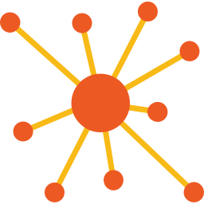
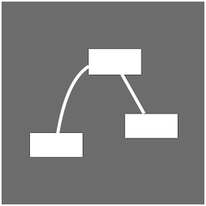

# Getting Started with Brain Visualizer

This guide will help you take your first steps with Brain Visualizer and understand the basic interface.

## Connecting to FEAGI

Brain Visualizer requires a running FEAGI instance to connect to. When you launch Brain Visualizer:

1. The application will automatically attempt to connect to FEAGI
2. You'll see a loading screen while the genome data is being retrieved
3. Once connected, the interface will activate and display your genome

### Connection Status

The **State Indicator** in the top bar shows your connection status:
- **Green**: Connected and operational
- **Yellow**: Connecting or syncing
- **Red**: Disconnected or error state

## Understanding the Interface

### Main Components

Brain Visualizer's interface consists of several key areas:

**Top Toolbar**
- Connection status and genome statistics
- Burst rate control (neural processing speed)
- Quick access buttons for Inputs, Circuits, Outputs
- Connectivity Rule manager
- Options and settings
- Camera animations
- UI scale controls
- This guide

**Circuit Builder (2D View)**
- Node-based graph showing your cortical areas as boxes
- Lines showing connections between areas
- Pan and zoom to navigate
- Double-click regions to explore sub-circuits

**Brain Monitor (3D View)**
- 3D volumetric representation of your genome
- Real-time neural activity visualization
- Interactive camera controls
- Hover over areas to see connections

### First Look at Your Genome

When Brain Visualizer loads, you'll see:

1. **Main Circuit**: The root region containing all your cortical areas
2. **Cortical Areas**: Boxes (2D) or volumes (3D) representing neural processing units
3. **Connections**: Lines showing how areas are connected

## Basic Navigation

### In Circuit Builder (2D)
- **Pan**: Middle mouse drag or Shift + Left mouse drag
- **Zoom**: Mouse wheel
- **Select**: Left-click on cortical areas or regions
- **Multi-select**: Ctrl + Click to add to selection

### In Brain Monitor (3D)
- **Rotate**: Left mouse drag
- **Pan**: Middle mouse drag or Shift + Left mouse drag
- **Zoom**: Mouse wheel or Right mouse drag
- **Focus**: Click on a cortical area to focus on it

See [Navigation Basics](navigation.md) for more details.

## Color Coding

Cortical areas use color coding to indicate their type:

- **Dark Gray**: Input (IPU) - receives data from outside

- **Orange**: Output (OPU) - sends data to outside

- **Blue**: Custom - internal processing

- **Dark Red**: Memory - stores and recalls patterns

- **Dark Blue**: Core - special system areas

## Top Bar Quick Reference

### Left Section (Genome Info)
- **Neuron Count**: Current number of neurons / maximum
- **Synapse Count**: Current number of synapses / maximum
- **Burst Rate**: Neural processing frequency in Hz

### Middle Section (Quick Access)

- **Inputs**: Create and manage input cortical areas (IPU)

- **Circuits**: Navigate and create brain circuits

- **Outputs**: Create and manage output cortical areas (OPU)

- **Connectivity Rules**: Manage connection templates

### Right Section (Tools)
- **Options**: Application settings and preferences
- **Camera Animations**: Save and play camera paths
- **Guide**: Open this help system
- **Activity Toggle**: Show/hide global neural connections
- **UI Scale**: Increase or decrease interface size

## Creating Your First Cortical Area

Let's create a simple input area:

1. Click **Inputs** in the top toolbar
2. Click the **+** button to create a new input
3. Select a template (e.g., "Vision" or "Generic Input")
4. Set the device count (typically 1 to start)
5. Choose a unit ID (leave default if unsure)
6. Click **Add**

You should now see a new gray box in the Circuit Builder and a volume in the Brain Monitor!

See [Cortical Areas](cortical_areas.md) for more details.

## Using the Quick Menu

Right-click any cortical area or region to open the **Quick Menu**, which provides context-sensitive operations:

- **Details**: View and edit properties
- **Quick Connect**: Connect to another area
- **Clone**: Duplicate the object
- **Move/Relocate**: Reposition in 2D or 3D
- **Add to Region**: Move into a different brain circuit
- **Reset**: Clear neural state
- **Delete**: Remove the object

See [Quick Menu](quick_menu.md) for complete details.

## Viewing Neural Activity

To see your genome in action:

1. Ensure FEAGI is processing (check the Burst Rate is above 0 Hz)
2. Open the **Brain Monitor** (3D view)
3. Neural activity will appear as colored highlights on cortical areas
4. Hover over areas to see their connections

See [Neural Activity](neural_activity.md) for more information.

## Using Split View

For the best workflow, use **Split View** to see both Circuit Builder and Brain Monitor simultaneously:

1. Right-click a brain circuit in Circuit Builder
2. Select **Open 3D Tab** from the Quick Menu
3. The interface will split, showing both views side-by-side

Alternatively, use the view controls in the top-left of the Circuit Builder tab.

See [Split View](split_view.md) for more details.

## Next Steps

Now that you understand the basics, explore these topics:

- [Circuit Builder](circuit_builder.md) - Build and organize neural circuits
- [Brain Monitor](brain_monitor.md) - Visualize in 3D
- [Cortical Areas](cortical_areas.md) - Create and configure processing units
- [Mapping Connections](mapping_connections.md) - Connect areas together
- [Navigation Basics](navigation.md) - Master camera controls

## Common Issues

**"No objects appear in my view"**
- Check that FEAGI has successfully loaded a genome
- Try zooming out or using "Fit All" in Circuit Builder
- Verify the connection status indicator is green

**"Neural activity isn't showing"**
- Check that Burst Rate is above 0 Hz
- Ensure your genome has active inputs providing data
- Verify connections exist between areas

**"Interface is too small/large"**
- Use the **+/-** buttons in the top-right to adjust UI scale
- See [UI Controls](ui_controls.md) for more options

[Back to Overview](index.md)
