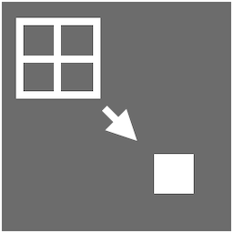
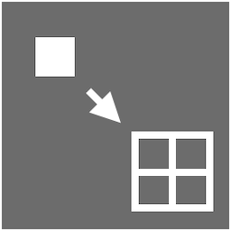
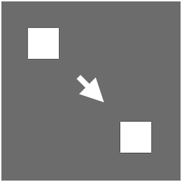
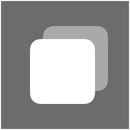
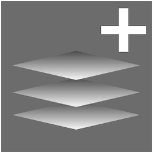
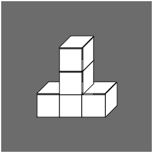

# Quick Menu

The Quick Menu is a context-sensitive menu that appears when you right-click objects in Brain Visualizer. It provides instant access to the most relevant operations for the selected object, dramatically speeding up your workflow.

## What is the Quick Menu?

The Quick Menu is a dynamic toolbar that shows different options based on:
- **What you clicked**: Cortical area, brain circuit, or empty space
- **Where you clicked**: Circuit Builder vs Brain Monitor
- **How many selected**: Single object vs multiple objects
- **Object type**: Different options for different cortical area types

This context-awareness means you always see relevant operations without navigating through menus.

## Opening the Quick Menu

**Standard Method:**
- **Right-click** on any cortical area or brain circuit
- Menu appears centered near your cursor
- Click an operation to perform it

**Context:**
- Works in Circuit Builder (2D view)
- Works in Brain Monitor (3D view)
- Menu appearance and position optimized for context

## Quick Menu for Cortical Areas

When right-clicking a single cortical area:

### Details Button

**Function**: View and edit cortical area properties

Opens the **Cortical Area Details** window with complete access to all parameters:
- Basic properties (name, dimensions, position)
- Neuron firing parameters
- Memory parameters
- Post-synaptic potential settings
- Neuron coding (IPU/OPU only)
- Monitoring and visualization
- Connection management
- Delete and reset operations

See the [Cortical Area Details](cortical_area_details.md) guide for complete documentation.

**Opens**: Advanced Cortical Properties window showing:
- General properties (name, dimensions, position)
- Statistics (neuron count, activity)
- Connections (afferent and efferent)
- Advanced settings (learning, plasticity)

**Use When:**
- Need to check area configuration
- Want to modify parameters
- Viewing connection list
- Troubleshooting issues

See [Cortical Areas](cortical_areas.md) for more details.

### Quick Connect Button

**Function**: Create connection to another cortical area

**Workflow:**
1. Click Quick Connect
2. Window opens with list of destination areas
3. Select target area(s)
4. Choose connectivity rule
5. Configure parameters
6. Create mapping

**Use When:**
- Building neural circuits
- Adding new pathways
- Connecting inputs to processing to outputs

See [Mapping Connections](mapping_connections.md) for details.

### Neuron-Level Quick Connect Buttons

**Connect Cortical Area → Neurons:**

- Connect this area's outputs to specific neurons in another area
- Fine-grained control
- Advanced use case

**Connect Neurons → Cortical Area:**

- Connect specific neurons to this area's inputs
- Precise wiring
- Advanced use case

**Connect Neurons → Neurons:**

- Direct neuron-to-neuron connections
- Maximum precision
- Expert-level feature

### Clone Button

**Function**: Duplicate this cortical area

**Process:**
1. Click Clone
2. Window opens with area properties pre-filled
3. Modify name (required - must be unique)
4. Adjust position, dimensions if desired
5. Click Clone

**Result:**
- New cortical area created with same configuration
- No connections copied (starts unconnected)
- Same type, parameters, and connectivity rule defaults

**Use When:**
- Creating similar areas
- Building symmetric structures
- Rapidly prototyping

### Add to Region Button

**Function**: Move cortical area to different brain circuit

**Workflow:**
1. Click Add to Region
2. Window shows region hierarchy
3. Select destination region
4. Click Move

**Result:**
- Area moves to new parent circuit
- All connections maintained
- Position may adjust

**Use When:**
- Reorganizing genome structure
- Grouping related areas
- Cleaning up organization

See [Brain Circuits](brain_circuits.md) for more details.

### Relocate 2D Button

**Function**: Set exact 2D position in Circuit Builder

**When Available:**
- Only when right-clicking in Circuit Builder
- Not available from Brain Monitor

**Workflow:**
1. Click Relocate 2D
2. Enter X and Y coordinates
3. Click Apply

**Use When:**
- Precise positioning needed
- Aligning multiple areas
- Organizing circuit layout

### Move 3D Button

**Function**: Activate 3D movement gizmo

**When Available:**
- Available from both views
- Disabled in Circuit Builder context (use 2D relocate instead)

**Usage:**
1. Click Move 3D
2. Colored arrows appear in Brain Monitor
   - Red = X axis
   - Green = Y axis
   - Blue = Z axis
3. Click and drag arrows to move along that axis
4. Click central sphere to move freely

**Use When:**
- Repositioning in 3D space
- Organizing spatial layout
- Creating specific arrangements

### Resize 3D Button

**Function**: Activate 3D resize gizmo

**When Available:**
- Only for Custom and Memory cortical areas
- Not available for IPU/OPU (dimensions determined by templates)
- Disabled in Circuit Builder context

**Usage:**
1. Click Resize 3D
2. Handles appear on cortical volume in Brain Monitor
3. Drag handles to resize along specific dimensions
4. Corner handles resize multiple dimensions

**Use When:**
- Adjusting processing capacity
- Fitting into spatial constraints
- Optimizing neuron count

**Note:** Resizing changes neuron count. Check capacity limits.

### Reset Button

**Function**: Clear all neural state in this cortical area

**What It Does:**
- Resets all neuron values to initial state
- Clears learned synaptic weights (if plastic)
- Resets activity patterns
- Does NOT delete the area or connections

**Confirmation:**
- Requires confirmation before proceeding
- Cannot be undone

**Use When:**
- Starting fresh after testing
- Clearing corrupted state
- Beginning new training
- Debugging unexpected behavior

### Delete Button

**Function**: Remove this cortical area permanently

**What It Shows:**
- Confirmation window
- Lists all affected connections
- Shows impact on other areas

**Result:**
- Cortical area removed from genome
- All connections to/from it deleted
- Cannot be undone

**Use When:**
- Removing unused areas
- Simplifying circuits
- Major restructuring

**Caution:** This is permanent. Consider disconnecting first to test impact.

## Quick Menu for Brain Circuits

When right-clicking a brain circuit node:

### Details Button

**Function**: View and edit region properties

**Opens**: Region Properties window showing:
- Name and description
- Parent region
- Contained cortical areas
- Contained sub-circuits
- Statistics (total neurons, synapses)

**Use When:**
- Viewing region contents
- Renaming region
- Understanding organization
- Navigating hierarchy

### Open 3D Tab Button

**Function**: Open this region in dedicated 3D view with split view

**Result:**
- Split View activates
- Circuit Builder shows this region (left/top)
- Brain Monitor shows this region in 3D (right/bottom)
- Both synchronized

**Use When:**
- Working on specific region
- Need both 2D and 3D views
- Monitoring region in isolation
- Focus on subsystem

See [Split View](split_view.md) for more details.

### Clone Button

**Function**: Duplicate entire brain circuit

**Options:**
- Clone structure only (empty region with same hierarchy)
- Clone with contents (all cortical areas and sub-circuits)
- Clone with connections (internal and/or external)

**Use When:**
- Creating symmetric structures
- Replicating functional modules
- Building from templates

**Caution:** Can create many neurons. Check capacity first.

### Add to Region Button

**Function**: Nest this region inside another region

**Result:**
- Region moves with all its contents
- Hierarchy reorganizes
- All connections maintained

**Use When:**
- Restructuring organization
- Creating deeper hierarchies
- Grouping related regions

### Delete Button

**Function**: Remove brain circuit

**Options:**
- Delete region only (moves contents to parent)
- Delete region and contents (recursive deletion)

**Confirmation:**
- Shows what will be affected
- Lists contained areas and sub-circuits
- Cannot be undone

**Use When:**
- Simplifying hierarchy
- Removing empty regions
- Major restructuring

**Caution:** Deleting with contents removes everything inside.

## Quick Menu for Multiple Selection

When multiple cortical areas are selected:

**Available Operations:**
- **Details**: View properties of all selected
- **Add to Region**: Move all to same region
- **Delete**: Remove all selected areas

**Unavailable:**
- Operations requiring single target
- Type-specific operations

**Use When:**
- Bulk operations needed
- Reorganizing multiple areas
- Cleaning up circuits

## Quick Menu in Empty Space

Right-clicking empty space in Circuit Builder:

**Available Options:**
- **Create Cortical Area**: Open creation wizard
- **Create Region**: Create new brain circuit
- **Fit All**: Zoom to show all objects
- **Layout Options**: Auto-arrange (if available)

**Use When:**
- Starting new structures
- Need overview
- Organizing layout

## Quick Menu Keyboard Shortcuts

While Quick Menu is open:

- **Escape**: Close menu without action
- **Click outside**: Close menu
- **Number keys**: Select button (if numbered)
- **Arrow keys**: Navigate buttons (if supported)

## Tips for Efficient Quick Menu Use

### Muscle Memory

1. **Right-click becomes automatic**: Practice frequently
2. **Learn button positions**: Same layout every time
3. **Quick sequences**: Right-click → button becomes one motion
4. **Keyboard combo**: Right-click + key for speed

### Common Patterns

**Create and Connect:**
1. Create cortical area
2. Right-click it → Quick Connect
3. Choose destination → Create mapping
4. Repeat for more connections

**Inspect and Modify:**
1. Right-click area → Details
2. Review properties
3. Close details
4. Right-click → appropriate modification button

**Clone and Position:**
1. Right-click area → Clone
2. Set name and parameters
3. Right-click clone → Move 3D or Relocate 2D
4. Position precisely

### When to Use vs Menus

**Use Quick Menu For:**
- Operations on specific objects
- Context-dependent actions
- Frequently-used operations
- Workflow speed

**Use Top Toolbar For:**
- Creating new objects from scratch
- Global operations
- Settings and preferences
- Non-object-specific actions

## Context-Specific Behavior

### Circuit Builder vs Brain Monitor

**Circuit Builder:**
- Relocate 2D available
- Move 3D and Resize 3D disabled
- Optimized for 2D layout operations

**Brain Monitor:**
- Relocate 2D not available
- Move 3D and Resize 3D enabled
- Optimized for 3D spatial operations

### Selection Context

The menu remembers where selection originated:
- Circuit Builder click → Circuit Builder context
- Brain Monitor click → Brain Monitor context
- Different options based on source

## Troubleshooting

**"Quick Menu won't open"**
- Ensure you're right-clicking an object
- Check object isn't locked (if feature exists)
- Try clicking object first, then right-click
- Verify mouse right-click is working

**"Some buttons are grayed out"**
- Normal - context-dependent availability
- Disabled buttons aren't relevant for this object/context
- Hover for tooltip explaining why

**"Quick Menu appears in wrong place"**
- Should appear near cursor
- May adjust to stay on screen
- Can't be repositioned

**"Pressed button but nothing happened"**
- Check if confirmation dialog opened
- Look for error notification
- Verify FEAGI connection is active
- Check if operation requires additional input

## Best Practices

1. **Right-Click First**: Make it your first instinct
2. **Check Context**: Notice which buttons are available
3. **Read Tooltips**: Hover before clicking if unsure
4. **Practice Sequences**: Build muscle memory for common operations
5. **Combine with Keyboard**: Right-click + hotkey for speed
6. **Close When Done**: Don't leave menu open
7. **Use Consistently**: Faster than navigating menus

## Related Topics

- [Cortical Areas](cortical_areas.md) - Object operations
- [Brain Circuits](brain_circuits.md) - Region operations
- [Mapping Connections](mapping_connections.md) - Quick Connect feature
- [Circuit Builder](circuit_builder.md) - 2D context
- [Brain Monitor](brain_monitor.md) - 3D context
- [Navigation Basics](navigation.md) - Selection and interaction

[Back to Overview](index.md)
